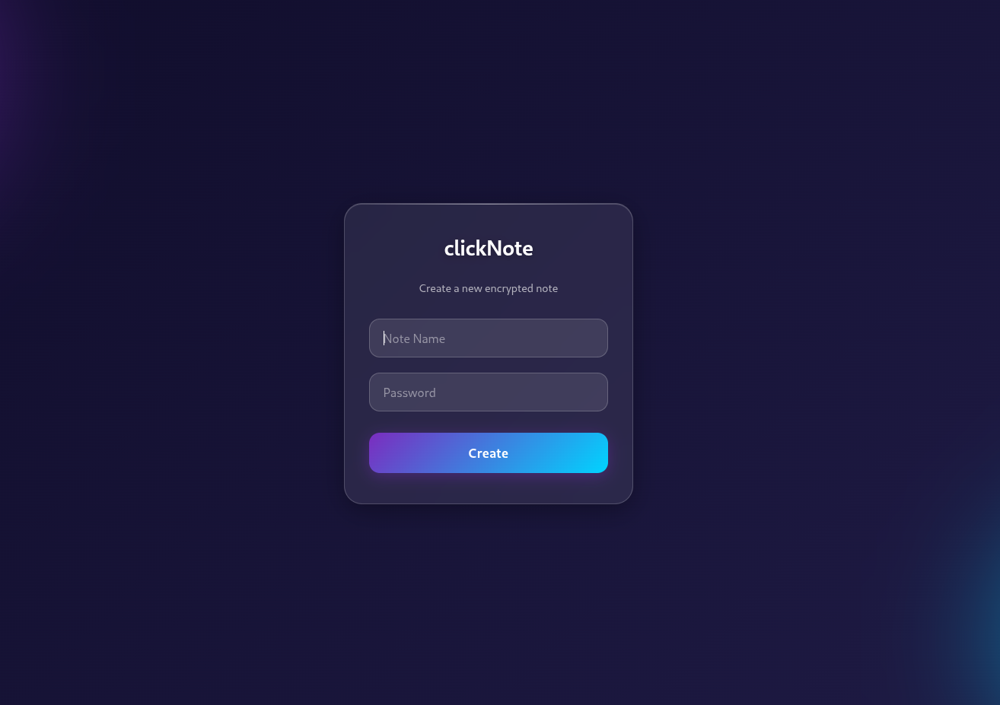
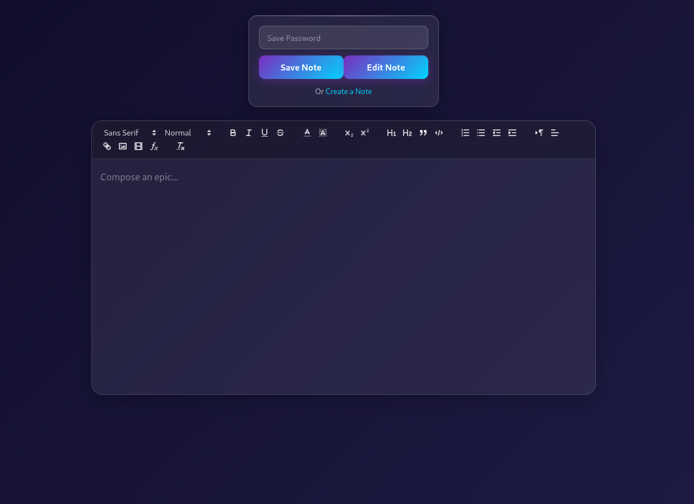
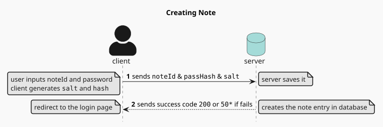
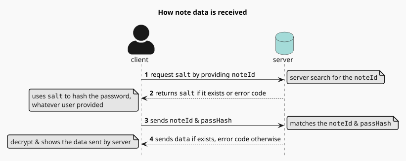
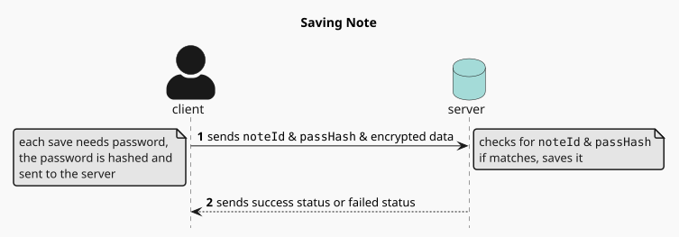

# clickNote
## A minimal end-to-end encrypted note app with rich text editor powered by Quill.js

### Features:
- End-to-End encrypted conpletely on the frontend, data won't get to the server unencrypted
- Rich-Text editor using Quill.js
- supports embeded photos and videos

### Screenshots:

### Installation:
- just clone the repo
- run in command-line `make run`

#### *NOTE: As an offline maniac I've bundled the dependencies in the repo using `go mod vendor`. It is for easy installation. Just need a `go` compiler.*

### Tech Stack:
- Front-End: JavaScript
- Back-End: Go, Gin
- Database: sqlite3 (easily migrateable to any sql based database)
- Encryption: 
    - Hashing: scrypt
    - cypher: AES-CBC 256
- Diagram: PlantUML

### Sequence Diagram for Easy Visualization:

